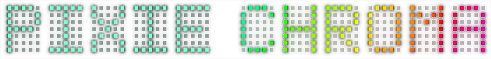

 

  <b>Arduino library and documentation for Pixie Chroma displays!</b> 
   · · · <a href="https://connornishijima.github.io/Pixie_Chroma/?section=docs"><b>LIBRARY DOCS</b></a> · · · 
  <a href="https://connornishijima.github.io/Pixie_Chroma/?section=datasheet"><b>DATASHEET</b></a> · · · 
  <a href="https://connornishijima.github.io/Pixie_Chroma/?section=tutorials"><b>TUTORIALS</b></a> · · · 
  <a href="https://connornishijima.github.io/Pixie_Chroma/?section=oshw"><b>OSHW</b></a> · · · 
    
  
  
  
  
  

*This repository is still under construction, make sure to follow our Twitter for official releases!*

**[@lixielabs](https://twitter.com/lixielabs)**

PIXIE CHROMA is a dual-5x7 character display for Arduino, that can be easily chained to create easy-to-use displays as long or tall as you'd like!
	
Featuring 70 addressable RGB LEDs, Pixie Chroma can be controlled with as little as a single GPIO! Here's a quick peek at how easy that is:
	
    #include "Pixie_Chroma.h"
    PixieChroma pix;
    #define PIXIES_X  6  // Total amount and         x x x x x x
    #define PIXIES_Y  2  // arrangement of Pixies =  x x x x x x

    void setup() {
      pix.begin(13, PIXIES_X, PIXIES_Y); // ... Use Pin 13
      pix.color(CRGB(0,0,255)); // ............ Set color to blue
    }

    void loop() {
      pix.clear(); // ................... Clear display
      pix.println("Hello World!"); // ... Write text on first row
      pix.print(millis()); // ........... Write the value of millis() on the second row
      pix.show(); // .................... Show changes
    }
		
In this case, (in just 16 lines) you're in control of over 800 LEDs to show any text you'd like! 
	
Pixie Chroma's Arduino library makes it extremely easy to control advanced animation in the background while other code runs! For example:

    #include "Pixie_Chroma.h" // ... Include library
    PixieChroma pix; // ............ Get class instance

    #define DATA_PIN  13 // ........ GPIO to use
    #define PIXIES_X  6  // ........ How many Pixie PCBs "wide" is our display?
    #define PIXIES_Y  1  // ........ How many tall?

    void setup() {
      pix.begin(DATA_PIN, PIXIES_X, PIXIES_Y); // ... Initialize Pixies
      pix.set_max_power(5, 500); // ................. Set power budget to 5V, 500mA

      // Set the color palette to use for text
      pix.set_palette(
        make_gradient( // ........... For our palette, we'll generate a gradient from:
          CRGB(255, 0,   0  ), // ... RED,
          CRGB(0,   255, 0  ), // ... GREEN,
          CRGB(255, 0,   0  )  // ... and RED.
        )
      );

      // Set the animation preset to "PALETTE SHIFT RIGHT",
      // which will cause our gradient to scroll right-to-left
      pix.set_animation(ANIMATION_PALETTE_SHIFT_RIGHT);

      // Sets the library into AUTOMATIC mode, which keeps 
      // the animation running smoothly in the background
      // while the microcontroller runs other functions                                  
      pix.set_update_mode(AUTOMATIC); 
    }

    uint32_t counter = 0; // This is a number to show on the display

    void loop() {
      pix.clear(); // ............ Clears the display
      pix.print( counter ); // ... Prints the value of "counter" to the display

      delay(500); // ............. Delay. During this time, animation will continue
                  //               smoothly scrolling our gradient defined in setup()

      counter++; // .............. Increment counter
    }
		
As you can see, Pixie Chroma is as easy, or advanced as you need! 
