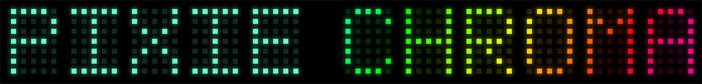
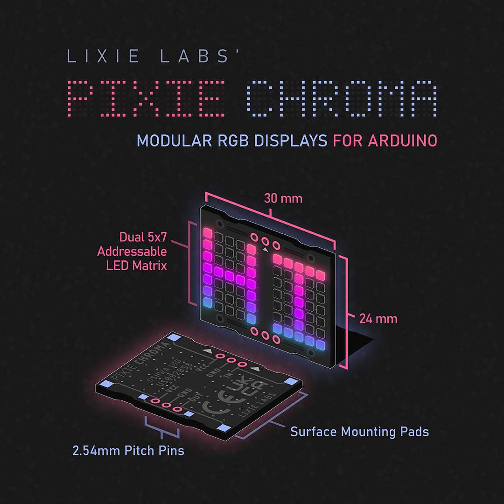

<br>


**PIXIE CHROMA** is a dual-5x7 character display for Arduino, that can be easily chained to create easy-to-use displays as long or tall as you'd like! Featuring 70 addressable RGB LEDs, Pixie Chroma can be controlled with as little as a single GPIO! (***Make sure to [follow our Twitter](https://twitter.com/lixielabs) for official news!***)

---------------------------------------------------------------------------------
<p align="center">
  &nbsp;&nbsp;· · ·&nbsp;&nbsp;
  <a href="https://connornishijima.github.io/Pixie_Chroma/?section=getting-started"><b>GETTING STARTED</b></a>
  &nbsp;&nbsp;· · ·&nbsp;&nbsp;
  <a href="https://connornishijima.github.io/Pixie_Chroma/?section=docs"><b>LIBRARY DOCS</b></a>
  &nbsp;&nbsp;· · ·&nbsp;&nbsp;
  <a href="https://connornishijima.github.io/Pixie_Chroma/?section=datasheet"><b>DATASHEET</b></a>
  &nbsp;&nbsp;· · ·&nbsp;&nbsp;
  <a href="https://github.com/connornishijima/Pixie_Chroma/tree/main/extras/OSHW"><b>OSHW</b></a>
  &nbsp;&nbsp;· · ·&nbsp;&nbsp;
  <a href="https://connornishijima.github.io/Pixie_Chroma/?section=purchase"><b>PURCHASE</b></a>
  &nbsp;&nbsp;· · ·&nbsp;&nbsp;
</p>
<p align="center">
  
  
  
  <a href="https://www.ardu-badge.com/Pixie_Chroma"></a>
</p>

---------------------------------------------------------------------------------

# Pixie Chroma Is the Display We Always Wanted


**Pixie Chroma is a project that we here at Lixie Labs are incredibly passionate about!** In this third iteration, we have finally created the best RGB text display we've ever used. While we loved our original Pixie models, we felt that you couldn't get the same level of creativity that you **can** get with Pixie Chroma. With its ability to be dropped into any breadboard and coded with any experience level, these displays have a wide range of potential uses, meaning anybody in the maker community can find a use for them! Pixie Chroma is our gift to you.



# Two Big New Features

Along with full RGB control, and an absolute **UNIT** of an Arduino Library, we are introducing two other **big** new features with this release: **Quad Mode** and **Shortcodes**.

----------------------------------------------------------


**Quad mode is made specifically for those wishing to drive their displays faster.** By *optionally* sending the data in four parallel streams with Quad Mode, you can expect to see a ~3.75x increase in speed! For example, if you had 12 Pixie Chromas, you can wire four GPIO of your microcontroller to the 1st, 4th, 7th, and 10th Pixie. Each GPIO is now only responsible for the data of three Pixie Chromas compared to *only one GPIO feeding all 12*. With this, you can run animations, scrolling, and color palettes more smoothly or free up processor time!

**NOTE:** Quad Mode currently uses hard-coded GPIO pins depending on your microcontroller. To see which pins are needed, visit [the documentation for begin_quad()](https://connornishijima.github.io/Pixie_Chroma/docs/class_pixie_chroma.html#af4c7b1051ce21bf03cfd69d30869fa6c).

----------------------------------------------------------


Our next big feature is **Shortcodes**, a **super simple way to show icons beyond the alphanumeric ASCII set and easily create animations!** We have an extensive library of 230+ built-in icons that are accessible by name within *other* strings. See the example above. Whether you want global currency symbols, weather states, schematic symbols, diacritics (àãåâä), or various mathematical typography such as pi, we probably have you covered. And, if we don't, you can make your own with the magical Shortcode Editor.

## Shortcode Editor

Our favorite part of these icons is how easy it is to make your own! With [our online/offline editor](https://connornishijima.github.io/Pixie_Chroma/?section=shortcodes), you can create any shape or image (so long as it fits in a 5x7 grid) and the editor will directly show the code that would print that shape!


This is one of the most creative outlets for cool display enthusiasts, since you can easily make custom frame-by-frame animations of your own! We are currently working on a way to create looping animations directly within the editor, and are excited to show it when it is complete.

# A New Standard for Arduino Libraries

**We pride ourselves in how easy our products are to use.** We have kept the wiring very simple, with only three wires connected to each breadboard-friendly display. Our code also has many examples that are explained line-by-line so that anybody can understand them. We even include [template Arduino Sketches](https://github.com/connornishijima/Pixie_Chroma/blob/main/examples/04_Minimal_Sketches/01_Standard/01_Standard.ino) to skip the parts newcomers find tedious, like `#include` directives and class definitions. Many advanced projects that even seasoned coders would find challenging are hassle-free with the Pixie Chroma library!

```cpp
#include "Pixie_Chroma.h" // Include library
PixieChroma pix;
#define PIXIES_X  6  // Total amount and         x x x x x x
#define PIXIES_Y  2  // arrangement of Pixies =  x x x x x x

void setup() {
  pix.begin( 13, PIXIES_X, PIXIES_Y ); // ... Use Pin 13
  pix.color( CRGB::Blue ); // ............... Set color to blue
}

void loop() {
  pix.clear(); // ..................... Clear display
  pix.println( "Hello World!" ); // ... Write text on first row
  pix.print( millis() ); // ........... Write the value of millis() on the second row
  pix.show(); // ...................... Show changes
}
```
# Amazing Documentation  

[Pixie Chroma's documentation](https://connornishijima.github.io/Pixie_Chroma/?section=docs) is complete, accurate, and easy to understand. Each function in the library is fully documented and code examples are sprinkled liberally throughout.


# Supported Platforms

Pixie Chroma is a bit RAM heavy for its effects and color processing. 8 Pixie Chroma PCBs is 560 LEDs, so that's 1,680 bytes just for the color data! Add in the masking tricks, XY mapping and more, and you're unfortunately not going to get a set of Chromas working on an older microcontroller like the ATMega328p with only 2K of SRAM. ***However***, more modern controllers like those from Espressif are perfectly fine! (ESP8266 has 80KiB of RAM!)

The Pixie Chroma library also uses FastLED as a dependency, so FastLED itself also needs compatibility before we can support it here. *This is why the RP2040 is not yet supported. Soon!*

## Fully Supported Microcontrollers

- ESP8266 (Adafruit HUZZAH, Wemos D1 Mini, etc.)
- ESP32 / ESP32-S2 (TinyPico, HUZZAH32, TinyS2)
- Teensy 3.x (Possibly Teensy 4.x, not yet tested)

## Currently Planned Support

- RP2040 (Needs FastLED port)
- ~ESP32-S2 (Needs testing)~ *Confirmed working*
- ESP32-S3 (Needs testing)
- SAMD21 (TODO, has been hard to get)

If you have success running Pixie Chroma on a controller not currently in this list, let us know! We'd be happy to incorporate it. (You'll need to modify [Pixie_Chroma.h](https://github.com/connornishijima/Pixie_Chroma/blob/main/src/Pixie_Chroma.h) to accept the new compilation target first.)


# Dedication to Our Craft

Lixie Labs is a homegrown business **dedicated to furthering open source hardware and software** in both the hobbyist and professional electronics industry. To this day, we still receive emails from customers asking us how to get their hands on products we no longer produce. Luckily, anybody can still create their own Lixies or even earlier versions of Pixies without us because we've left the entire process open for others. We hope to see all of our projects outlive us!

**Pixie Chroma is OSHWA certified ([UID US002058](https://certification.oshwa.org/us002058.html))**, we've created an [extensive datasheet](https://connornishijima.github.io/Pixie_Chroma/?section=datasheet), and every single function within the library comes with [documentation](https://connornishijima.github.io/Pixie_Chroma/?section=docs).


# Features & Specifications

- Dual-5x7 RGB LED matrices
- 3.7 to 5.5 VDC supply
- Fast bitmap control
- 8-bit global dimming
- 27.5 mm x 16.5 mm matrix size (10.16 PPI)
- 30 mm x 24 mm package


# Comparison Table

|                                              | Pixie Chroma                | 5x5 RGB Matrix Breakout      | Dot Star 8x8 Grid            |
| -------------------------------------------- | --------------------------- | -----------------------------| ---------------------------- |
| **Manufacturer**                             | Lixie Labs                  | Pimoroni                     | Adafruit                     |
| **Size**                                     | 30 mm x 24 mm               | 19 mm x 29 mm                | 25 mm x 36 mm                |
| **LED Count**                                | Dual 5x7 displays, 70 total | Single 5x5 display, 25 total | Single 8x8 display, 64 total |
| **Pixels Per Inch**                          | 10.16 PPI                   | 7.25 PPI                     | 8 PPI                        |
| **Experience Level**                         | All Levels                  | Intermediate                 | Beginner                     |
| **Open Source**                              | HW + SW                     | SW only                      | HW + SW                      |
| **Documented Code Functions**                | Yes                         | No                           | Yes                          |
| **Datasheet**                                | Yes                         | No                           | No                           |
| **Quad Mode** **¹**                          | Yes                         | No  (no parallel output)     | No  (no parallel output)     |
| **Shortcodes** **²**                         | Yes  (239 included)         | N/A                          | N/A                          |
| **Breadboard Compatible**                    | Yes                         | No                           | No                           |
| **Power Management Features**                | Yes                         | No                           | No                           |
| **Easy Text Rendering**                      | Yes                         | No                           | No                           |
| **Non Blocking Animation**                   | Yes                         | No                           | No                           |
| **Predefined Color Palettes and Animations** | Yes                         | No                           | No                           |
| **Price Per LED**                            | $0.32                       | $0.49                        | $0.39                        |

**¹** _Quad Mode allows you to update your displays faster by using four GPIO at once!_  
**²** _Shortcodes like `[:HEART:]` let you use over 230 built-in icons by name and even create your own!_  

# Support & Documentation

**As you can see, Pixie Chroma is as easy or as advanced as you need.** Luckily, you don't need to dive into documentation to get started - the included examples (`File -> Examples -> Pixie_Chroma`) provide a template you can easily modify for your own projects.

For further information, you can check out the:

- [Getting Started Guide](https://connornishijima.github.io/Pixie_Chroma/?section=getting-started)
- [Shortcode Library](https://connornishijima.github.io/Pixie_Chroma/?section=shortcodes)
- [Arduino Library Documentation](https://connornishijima.github.io/Pixie_Chroma/?section=docs)
- [Datasheet](https://connornishijima.github.io/Pixie_Chroma/?section=datasheet)
- [Twitter](https://twitter.com/lixielabs) - We post quite often with Pixie Chroma updates and tricks!

Everything is open source and available. Our source code has been fully documented and all PCB designs and parts used are open and available:

- [GitHub](https://github.com/connornishijima/Pixie_Chroma/#readme)
- [OSHW](https://github.com/connornishijima/Pixie_Chroma/tree/main/extras/OSHW/#readme)
- [OHSWA certification](https://certification.oshwa.org/us002058.html)

# Sponsors

- **[Nitz](https://github.com/nitz)** 
- **[mlctrez](https://github.com/mlctrez)**

# Credits

**Developed by Connor Nishijima for Lixie Labs (2021)**
