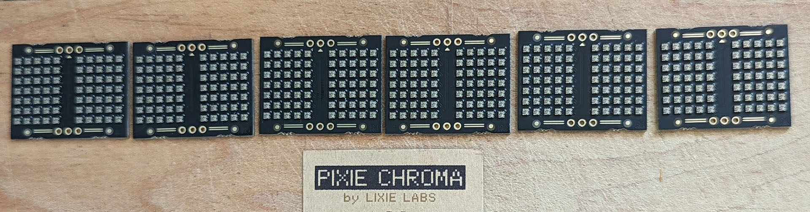
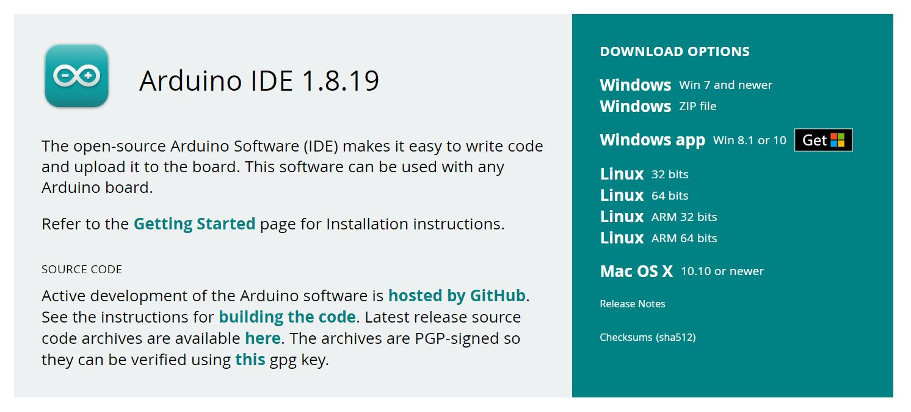
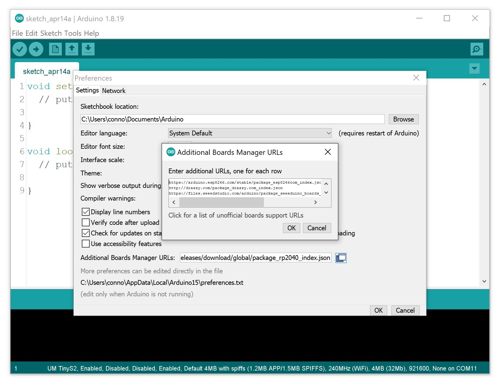
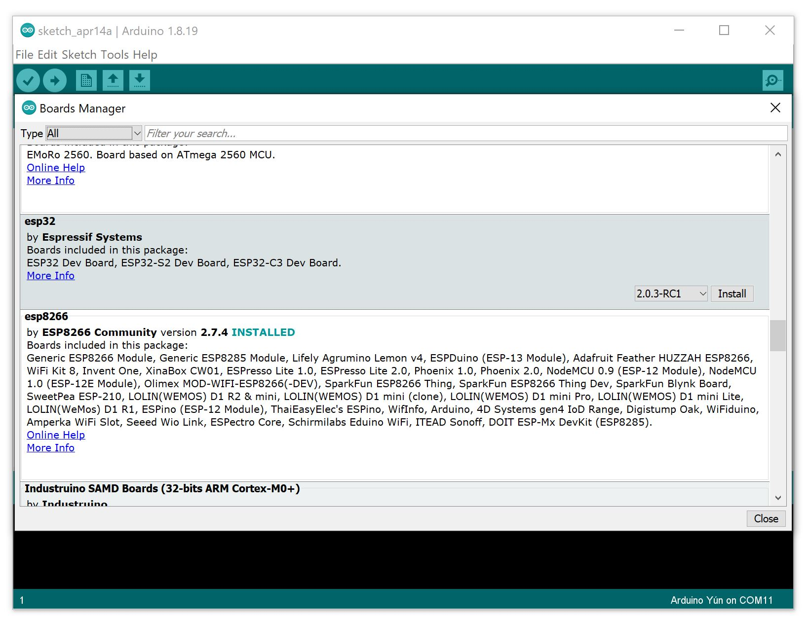
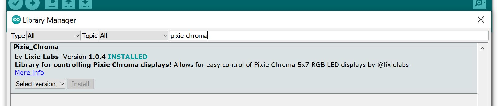
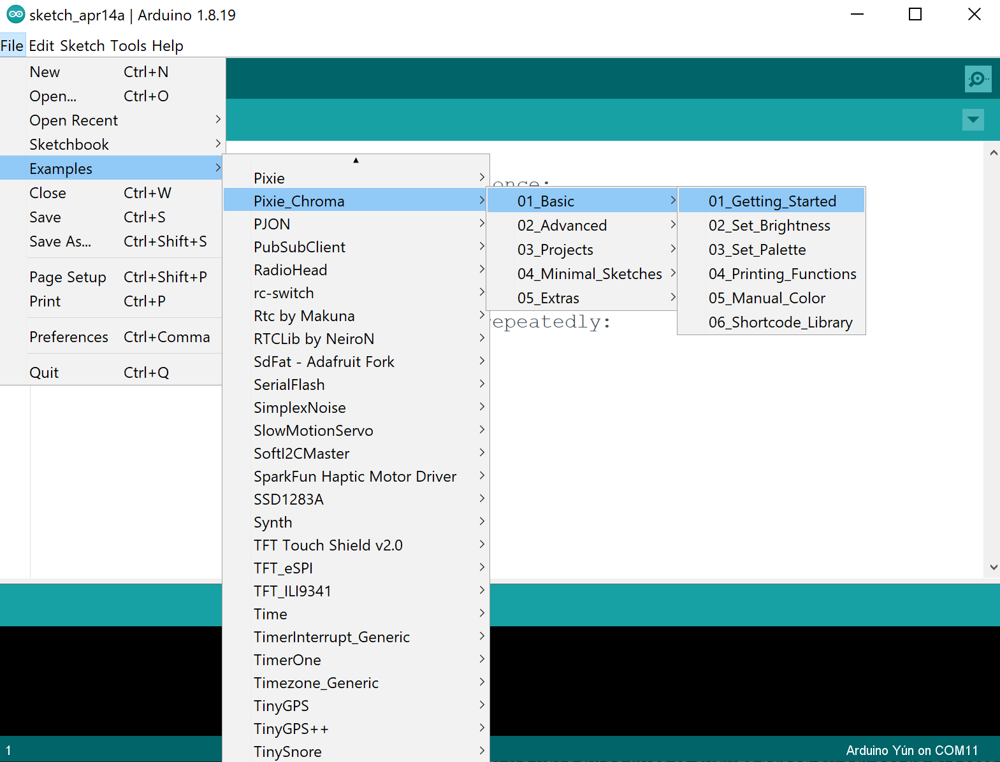

### HEY GUYS! *This file is currently being written, but public for now to help others that may need it. Formatting is still whack and pictures are TODO. (4/12/22) Work continues, should be finished tonight (4/13/22)*

|  |
|:--:|
| <b>Image by [@blenster](https://twitter.com/blenster)</b>|

# GETTING STARTED

Hello! You've just recieved Pixie Chromas in the mail, and if you're as excited as we are to begin, there's only a few steps ahead of you before they light up. You may even have some steps complete already, feel free to skip ahead!

#### NOTE: Please see the [current list of supported microcontrollers](https://github.com/connornishijima/Pixie_Chroma#supported-platforms) in the README - ESP32 is currently the most powerful option for Pixie Chroma projects, and is quite cheap too!

-------------------------------------------------------------

### ***If you're new to coding for electronics, we have a small [Glossary](#glossary) at the bottom of this page you can refer to.***

-------------------------------------------------------------

1. [Download Arduino IDE](#1-download-arduino-ide)
2. [Installing Board Definitions](#2-installing-board-definitions)
3. [Installing the Pixie Chroma Arduino Library](#3-installing-the-pixie-chroma-arduino-library)
4. [Wiring](#4-wiring)
5. [Uploading Example Code](#5-uploading-example-code)
6. [Writing your own Pixie Chroma code](#6-writing-your-own-pixie-chroma-code)
7. [Extra: Diagnosing Issues](#7-diagnosing-issues)

# 1. Download Arduino IDE

Visit [www.arduino.cc/downloads](https://www.arduino.cc/downloads) and download the latest version of the IDE for your operating system.

Once downloaded and installed, proceed to Step 2.

#### NOTE: This tutorial will center around the *1.X* version of Arduino IDE. A guide for the upcoming *2.X* version is planned for a future date when that version finishes its Release Candidate period.

# 2. Installing Board Definitions

Arduino IDE is where you'll be writing code to control your Pixie Chromas, but it first has to know which type of microcontroller you're using! This is where **Board Definitions** come in. These allow Arduino IDE to translate your code into instructions that your specific controller can understand.
	
You can add new board definitions under: `File > Preferences > Additional Boards Manager URLs`.

This will open a window where you can copy / paste in the following URLs, depending on the micocontroller you are using:

    ESP8266:
    https://arduino.esp8266.com/stable/package_esp8266com_index.json
    	
    ESP32:
    https://raw.githubusercontent.com/espressif/arduino-esp32/gh-pages/package_esp32_dev_index.json
    	
    Teensy 3.X:
    Teensy controllers use a more custom set up, follow the instructions on this page to install Teensy support:
    https://www.pjrc.com/teensy/td_download.html

Once a new Board Definition is pasted in, open `Tools > Board > Boards Manager`.

Another window will pop up, and once the list loads you'll now see an entry that matches your microcontroller and you can click "Install" to enable support in Arduino IDE for your microcontroller type.

# 3. Installing the Pixie Chroma Arduino Library

Now that Arduino IDE supports your microcontroller, we need to install the Pixie Chroma "Library". Libraries are a way to package pre-made code in a simple way. There are *thousands of lines of code* inside the Pixie Chroma library, but because it is packaged as a library, the code *you* write only needs an `#include "Pixie_Chroma.h"` line at the top to use it all!

Open the menu again: `Sketch > Include Library > Manage Libraries...`

When this window appears (it may take some time to unfreeze after opening) you can use the search box to find "pixie chroma", with Lixie Labs listed as the author. Install the latest version, then proceed to Step 4!

# 4. Wiring

Almost there! This part is quite important. **LEDs are happy to burn themselves out if wired incorrectly**, so follow along carefully!

Begin by inserting your displays into a breadboard like so:

	PIC
	
Take care to space them so that each LED matrix is equally spaced apart! Once the Pixies are laid out, we'll start with power wiring.

### NOTE: DO NOT LEAVE THE MICROCONTROLLER CONNECTED TO USB WHILE WIRING POWER, JUST IN CASE SOMETHING COMES LOOSE OR YOU MAKE A MISTAKE!

Using the included Pinout Card as a reference, wire up your power lines like so:

	PIC

You can also use standard breadboard jumpers that aren't cut to size like these, but custom wires help to reduce the likelihood of accidentally snagging a loose one while improving appearances.

Next, we'll connect the data lines from the bottom of each PCB to the top of the next like so ("OUT" of one board to the "IN" of the next):

	PIC

### NOTE: Pixies are always arranged / wired in western reading order: Left to Right in each row, from Top to Bottom.

Lastly, we'll connect it all to the microcontroller, in this case an ESP8266. The positive (red) rail of the breadboard should be connected to the 3.3V pin of the microcontroller, the negative (black or blue) rail of the breadboard should be connected to a GND pin, and the "IN" pin of your first Pixie Chroma in the chain should be connected to the GPIO of your choice. In this case, we'll use GPIO 5 (stupidly, confusingly marked "D1" on this microcontroller) like so:

	PIC

After double checking that your set up is identical to this photo (**ESPECIALLY** power lines), you can now plug in the USB cable to the microcontroller. *If nothing went 'zap', you did it!!!* The hardest part is over and you're ready to proceed to Step 5, where we'll see them light up for the first time!

# 5. Uploading Example Code

Wipe the sweat from your forehead, you're almost done! Next we'll upload example code to the microcontroller to have it show a sort of "HELLO" as a first test.

Back in the Arduino IDE, open `File > Examples > Pixie_Chroma > 01_Basic > 01_Getting_Started`.

	

Before uploading this code, we have three lines to change based on our set up process so far. 

	#define DATA_PIN  5  // GPIO to use for Pixie Chroma data line
	#define PIXIES_X  2  // Total amount and arrangement
	#define PIXIES_Y  1  // of Pixie PCBs = 2 x 1

DATA_PIN should be "5" in the case of this tutorial's wiring, and PIXIES_X should match how many Pixie PCBs wide our display is. (PIXIES_Y is for multi-row displays and will be left as "1" for now)

Once this change is made, we need to select the "Serial Port" our microcontroller is on so that the computer knows where to send the code. To do this, first unplug your microcontroller again. Now, open the `Tools > Port` menu and look at the entries, if any. There is a chance that although your microcontroller is unplugged, you'll still see ports available such as "COM1" on Windows, and "/dev/TTY*****" on Mac/Linux.

	PIC

These are likely virtual serial ports from your OS, or other devices attached to your computer. We don't want to work with these, so take note of their names.

Now, plug the microcontroller back in and check the Ports menu again. Whatever new entry that wasn't there before is your microcontroller, such as "COM6".

	PIC

Select this port, and hit the "Upload" button in the top left of the IDE:

	PIC

This first upload will likely take a few minutes to complete, as the IDE has to compile tons of new data that it will keep around for subsequent runs. After this, uploading will only take about 30-60 seconds.

	PIC
	
Did it work? If it did, *CONGRATULATIONS!* You should see "HI <3" on the displays, written in pink! If not, skip ahead to Step 7 to begin diagnosing the issue.

# 6. Writing your own Pixie Chroma code 

While we have an extensive [Pixie Chroma Software Documentation site](https://connornishijima.github.io/Pixie_Chroma/?section=docs) which details every single bit of the library available for you to use, there are only a few basic functions to learn for most projects:

--------------------------------------------------

**pix.begin(** *DATA_PIN*, *PIXIES_X*, *PIXIES_Y* **);**

`pix.begin()` is a necessary function you need in the `setup()` of your Arduino Sketch. This initializes the library and helps it to understand the size of display you have built.
             
Pixie Chroma allows for multi-row displays, which are wired in western reading order (left to right, top to bottom) and their shape is defined here. For example, a 16-Pixie display with two rows of eight:
              
    data_pin
       |
    +--+-+   +----+   +----+   +----+   +----+   +----+   +----+   +----+
    |  1 |-->|  2 |-->|  3 |-->|  4 |-->|  5 |-->|  6 |-->|  7 |-->|  8 | 
    +----+   +----+   +----+   +----+   +----+   +----+   +----+   +--+-+
                                                                      |
       +--------------------------------------------------------------+
       |
    +----+   +----+   +----+   +----+   +----+   +----+   +----+   +----+
    |  9 |-->| 10 |-->| 11 |-->| 12 |-->| 13 |-->| 14 |-->| 15 |-->| 16 | 
    +----+   +----+   +----+   +----+   +----+   +----+   +----+   +----+
    
The corresponding setup for this display layout would be:
    
    #include "Pixie_Chroma.h"
    PixieChroma pix;

    #define DATA_PIN 5
    #define PIXIES_X 8
    #define PIXIES_Y 2

    void setup() {
        pix.begin( DATA_PIN, PIXIES_X, PIXIES_Y );
    }

--------------------------------------------------

Even better than writing some these functions out, an easy time saver is to use the **Minimal Sketches**.

	PIC
	
These templates (included as library examples) cover all of the basic setup necessities to write code for Pixie Chroma, leaving only the fun parts!

There are two templates, one for "Standard Mode" and one for "Quad Mode". Quad Mode is for power users with experience and requires more complex wiring, so most for most projects "Standard Mode" will do.

# 7. Diagnosing Issues

Below are a few types of issues you may face if something wasn't configured / wired / soldered properly.

### PCB DOES NOT LIGHT UP

Here are a few steps to take if your Pixie Chroma PCB isn't functioning as expected. There are two types of failure:

#### PCB DOES NOT LIGHT UP AT ALL

This may be nerve-wracking, but a few easy mistakes can cause this:

1. Are your Pixie Chromas powered with the same voltage level your GPIO pins operate at?

# GLOSSARY

These are some terms you'll need to know for this guide:

#### Microcontroller

A small, simple processor capable of running custom code and physically interfacing with other electronics

#### IDE

Integrated Development Environment - the software used to write code, which (in this case) also handles uploading it to a microcontroller.

#### Arduino

An open-source ecosystem for designing electronic circuits based around microcontrollers. Annoyingly, this term is used interchangably to describe both the Arduino IDE and informally describe many microcontrollers that work with it.

#### Sketch

The even more annoying name Arduino chose to describe code written by users. You "Write a sketch" and upload the "sketch" to your microcontroller. (This term actually originates from Processing, a motion graphics software that Arduino IDE is forked from, as is the very old ".pde" file extension Arduino used to use a decade ago.)

#### GPIO

General-Purpose Input/Output - These are physical pins on the microcontroller that can be selectively given/denied power by users' code. They can also act as inputs, measuring the outside world for changes such as a button press.
